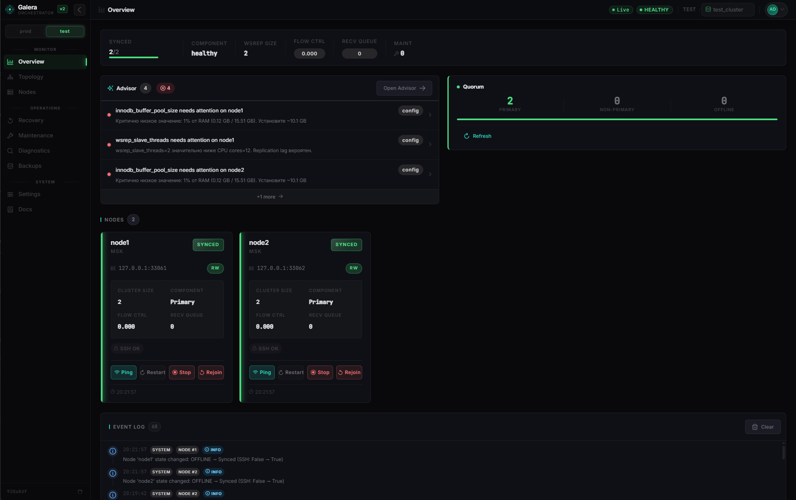
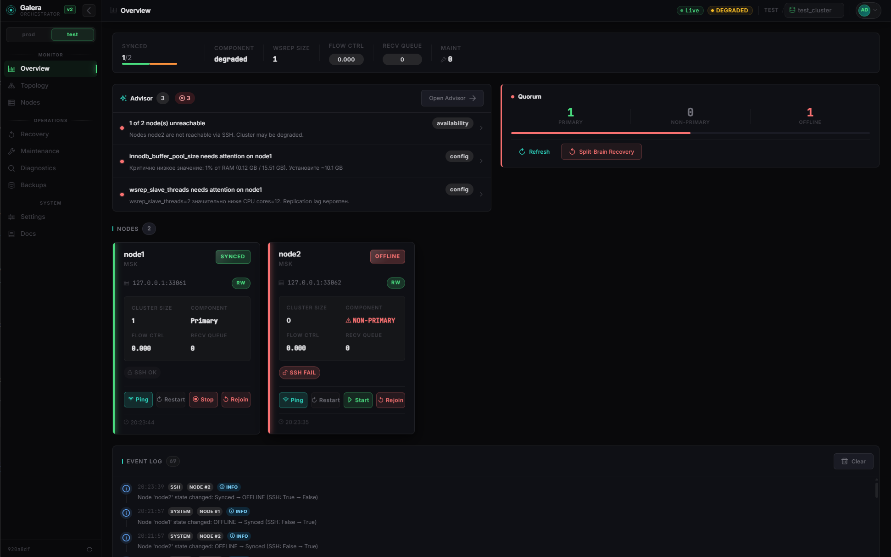
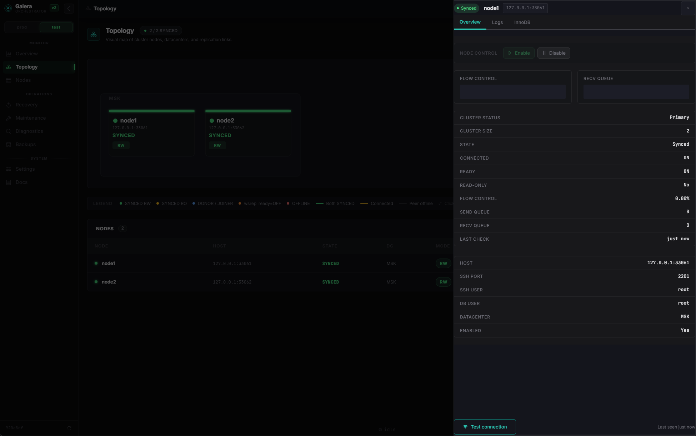
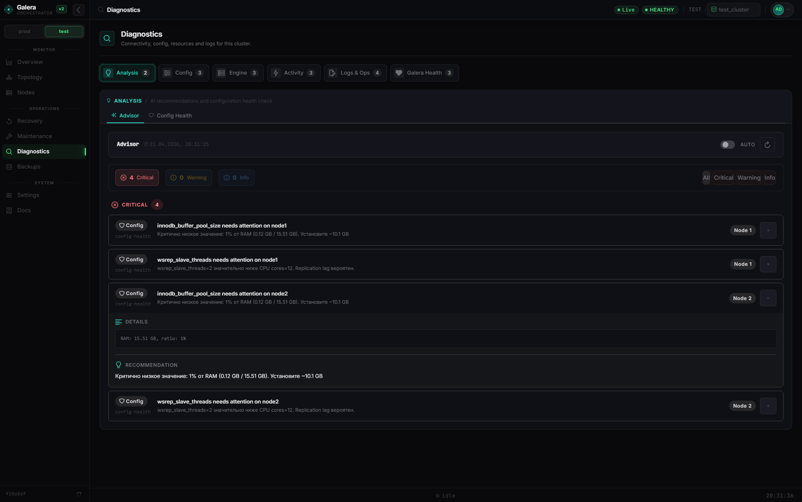
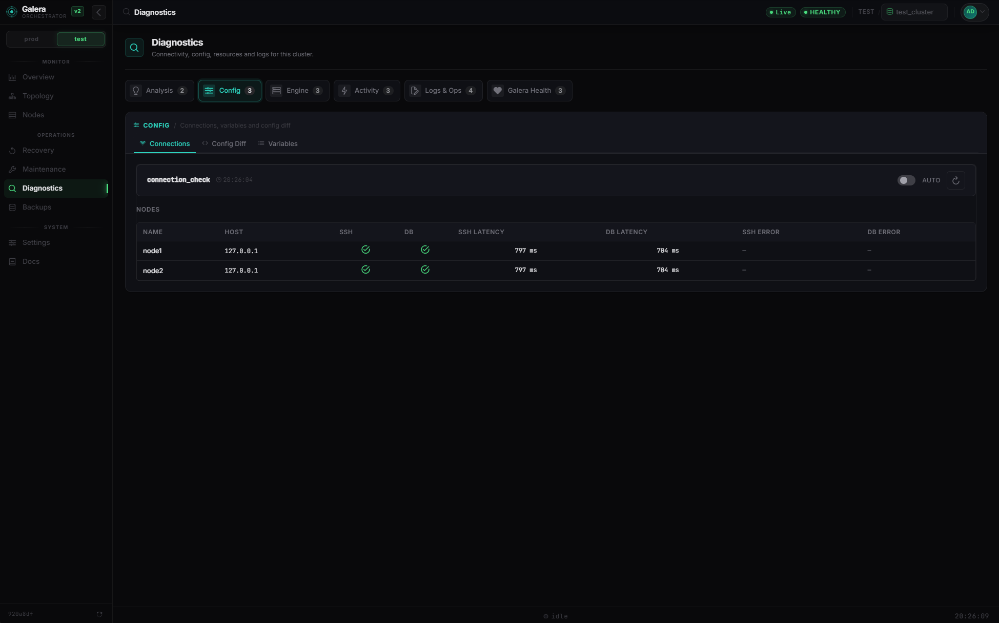
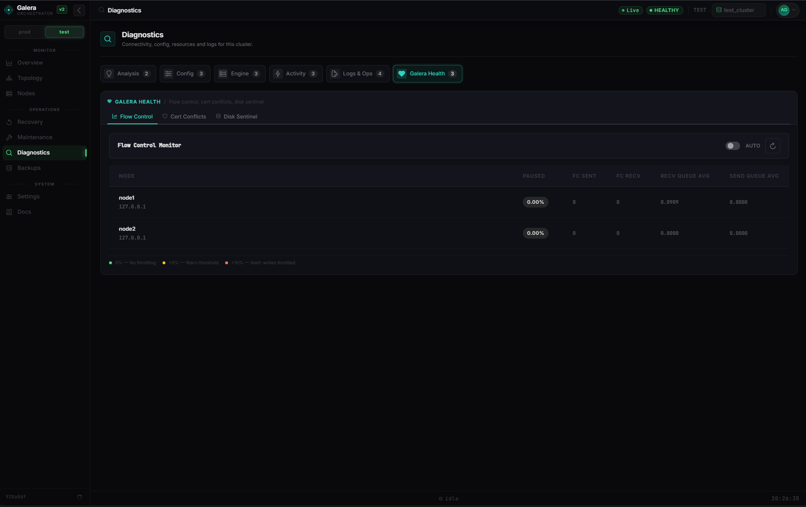
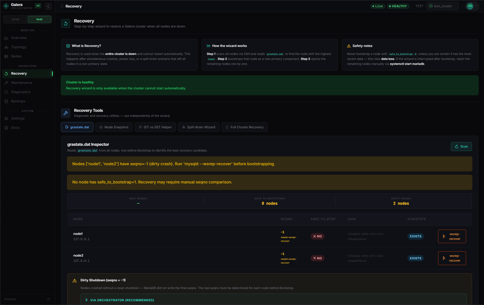
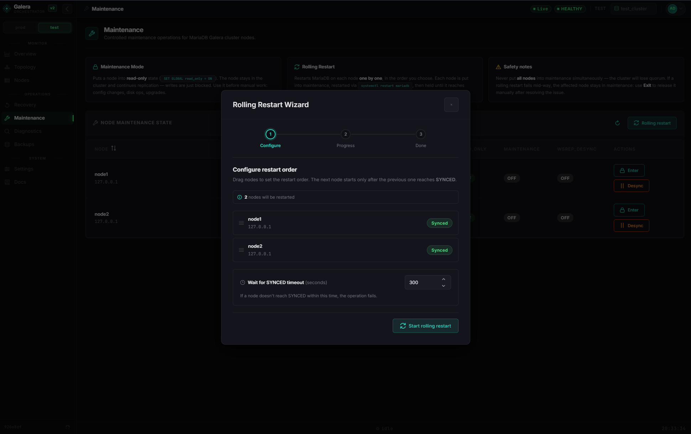

<div align="center">

<br/>

```
 ██████╗  █████╗ ██╗     ███████╗██████╗  █████╗
██╔════╝ ██╔══██╗██║     ██╔════╝██╔══██╗██╔══██╗
██║  ███╗███████║██║     █████╗  ██████╔╝███████║
██║   ██║██╔══██║██║     ██╔══╝  ██╔══██╗██╔══██║
╚██████╔╝██║  ██║███████╗███████╗██║  ██║██║  ██║
 ╚═════╝ ╚═╝  ╚═╝╚══════╝╚══════╝╚═╝  ╚═╝╚═╝  ╚═╝

 ██████╗ ██████╗  ██████╗██╗  ██╗███████╗███████╗████████╗██████╗  █████╗ ████████╗ ██████╗ ██████╗
██╔═══██╗██╔══██╗██╔════╝██║  ██║██╔════╝██╔════╝╚══██╔══╝██╔══██╗██╔══██╗╚══██╔══╝██╔═══██╗██╔══██╗
██║   ██║██████╔╝██║     ███████║█████╗  ███████╗   ██║   ██████╔╝███████║   ██║   ██║   ██║██████╔╝
██║   ██║██╔══██╗██║     ██╔══██║██╔══╝  ╚════██║   ██║   ██╔══██╗██╔══██║   ██║   ██║   ██║██╔══██╗
╚██████╔╝██║  ██║╚██████╗██║  ██║███████╗███████║   ██║   ██║  ██║██║  ██║   ██║   ╚██████╔╝██║  ██║
 ╚═════╝ ╚═╝  ╚═╝ ╚═════╝╚═╝  ╚═╝╚══════╝╚══════╝   ╚═╝   ╚═╝  ╚═╝╚═╝  ╚═╝   ╚═╝    ╚═════╝ ╚═╝  ╚═╝
```

**Self-hosted control panel for MariaDB Galera clusters**

Real-time monitoring · Full cluster recovery · Split-brain resolution · SSH diagnostics · Smart Advisor  
All from a **single Docker container**. No agents on nodes. No plugins. No magic.

<br/>

[](https://python.org)
[](https://fastapi.tiangolo.com)
[](https://vuejs.org)
[](https://vitejs.dev)
[](https://docker.com)
[](https://sqlite.org)

<br/>

[](LICENSE)
[](https://mariadb.com/kb/en/galera-cluster/)
[](https://developer.mozilla.org/en-US/docs/Web/API/WebSockets_API)
[](https://jwt.io)
[](https://www.paramiko.org)

</div>

---

## What is this?

Galera Orchestrator v2 connects to your nodes directly via **SSH and MariaDB** — no agents, no plugins, no sidecar containers. You get a full ops panel that covers daily monitoring, incident diagnostics, and worst-case cluster recovery, all from a browser.

```
  Your Browser  ──────►  Docker Container (:8000)
                               │
                    ┌──────────┴──────────┐
                    │  Vue 3 SPA          │  dark UI, PrimeVue 4
                    │  FastAPI REST API   │  /api/clusters/{id}/...
                    │  WebSocket          │  /ws/clusters/{id}
                    │  Background Poller  │  asyncio · per cluster · every 5s
                    └──────────┬──────────┘
                               │  SSH + MariaDB  (no agents)
              ┌────────────────┼────────────────┐
              ▼                ▼                ▼
           node-1           node-2           node-3
        SSH+MariaDB      SSH+MariaDB      SSH+MariaDB
```

---

## Screenshots

<div align="center">

**Overview — healthy cluster with Smart Advisor**


**Overview — degraded cluster, availability alert**


**Topology — visual cluster map with node detail panel**


**Diagnostics — Smart Advisor with critical findings**


**Diagnostics — Connection Check (SSH + DB latency)**


**Diagnostics — Flow Control Monitor**


**Recovery — grastate.dat Inspector (dirty crash scenario)**


**Maintenance — Rolling Restart Wizard**


</div>

---

## What's New

> **Recovery & Diagnostics v2** — commit `f80c074`

This release adds 9 new features across monitoring and incident recovery. All backends are real — no mock data.

### New on Overview

| Feature | Description |
|---|---|
| **Quorum Health Score** | Live widget showing primary / non-primary / offline node counts. Colour-coded severity: `healthy` → `degraded` → `critical`. Direct link to Recovery Tools. |

### New in Diagnostics — Galera Health group

A dedicated tab group with three live Galera-specific panels:

| Panel | Metric | Alert condition |
|---|---|---|
| **Flow Control Monitor** | `wsrep_flow_control_paused` — fraction of time cluster was flow-controlled | > 10% warn, > 30% critical |
| **Cert Conflict Rate** | `wsrep_local_cert_failures` delta per minute | rising trend — write-set conflicts between nodes |
| **Disk Sentinel** | gcache actual size vs `galera.cache` configured limit + `ibdata1` growth | > 90% of gcache limit → SST risk |

### New on Recovery page — standalone Recovery Tools

Five independent tools available at any cluster state (no need to be in a failure scenario):

| Tool | What it does |
|---|---|
| **grastate.dat Inspector** | SSH-reads `grastate.dat` from every node. Compares `seqno`, `safe_to_bootstrap`, cluster `uuid`. Identifies the correct bootstrap candidate. |
| **Node State Snapshot** | One-shot pre-flight dump — collects `wsrep_*` status, disk, process list, active transactions, InnoDB status from all nodes in parallel. Useful for incident documentation before taking action. |
| **IST vs SST Helper** | Compares donor gcache size against the joiner's `seqno` gap. Tells you whether IST (fast, incremental) or SST (full copy) will happen before you rejoin — avoiding surprise full transfers. |
| **Split-Brain Recovery Wizard** | Resolves a split-brain cluster: select the trusted node, set `pc.bootstrap=YES` via `wsrep_provider_options`, verify primary component forms. Progress streamed live via WebSocket. |
| **Full Cluster Recovery** | Fully automatic: reads `grastate.dat`, picks the bootstrap candidate, bootstraps it, rejoins all remaining nodes in seqno order. Live terminal log. Requires explicit checkbox confirmation — it's destructive. |

### New API endpoints

```
GET  /{cluster_id}/diagnostics/flow-control      # wsrep_flow_control_paused live
GET  /{cluster_id}/diagnostics/cert-conflicts    # wsrep_local_cert_failures rate
GET  /{cluster_id}/diagnostics/disk-sentinel     # gcache vs ibdata1 sentinel
GET  /{cluster_id}/diagnostics/quorum-status     # quorum health score

GET  /{cluster_id}/recovery/grastate             # grastate.dat inspector
POST /{cluster_id}/recovery/snapshot             # pre-flight node snapshot
GET  /{cluster_id}/recovery/ist-sst-info         # IST vs SST recommendation
POST /{cluster_id}/recovery/split-brain          # split-brain recovery (202 async)
POST /{cluster_id}/recovery/full-cluster         # full cluster recovery (202 async)
```

---

## Contents

- [Quick Start](#quick-start)
- [Configuration](#configuration)
- [SSH Key Setup](#ssh-key-setup)
- [Pages & Features](#pages--features)
  - [Overview](#overview)
  - [Nodes](#nodes)
  - [Topology](#topology)
  - [Recovery](#recovery)
  - [Maintenance](#maintenance)
  - [Settings](#settings)
- [Diagnostics Suite](#diagnostics-suite)
- [Smart Advisor](#smart-advisor)
- [API Reference](#api-reference)
- [Architecture](#architecture)
- [Project Structure](#project-structure)
- [Data & Backup](#data--backup)
- [Development](#development)
- [Security](#security)
- [Troubleshooting](#troubleshooting)

---

## Quick Start

### Prerequisites

| Requirement | Notes |
|---|---|
| Docker 24+ | With Compose v2 plugin |
| SSH key | RSA or Ed25519, **no passphrase**, access to all Galera nodes |
| Python 3.8+ | Installer only — bcrypt hash + Fernet key generation |

### Option A — One-line installer (recommended)

```bash
curl -fsSL https://raw.githubusercontent.com/Leg1onary/galera_orchestrator_v2/master/install.sh | bash
```

The installer:
1. Checks Docker, Docker Compose, Python 3
2. Creates `~/galera-orchestrator/`, downloads compose file
3. Asks: login, password, SSH key path, port, HTTPS mode
4. Hashes password via bcrypt — plaintext never written
5. Auto-generates `JWT_SECRET_KEY` and `FERNET_SECRET_KEY`
6. Writes `.env` (`chmod 600`), pulls image, starts container

```
  Panel:  http://<your-server>:8000
  Login:  admin  (or whatever you entered)
```

> Set `COOKIE_SECURE=false` if not behind TLS.

### Option B — Docker Compose manually

```bash
curl -fsSL https://raw.githubusercontent.com/Leg1onary/galera_orchestrator_v2/master/docker-compose.ghcr.yml -o docker-compose.ghcr.yml
curl -fsSL https://raw.githubusercontent.com/Leg1onary/galera_orchestrator_v2/master/.env.example -o .env
nano .env
docker compose -f docker-compose.ghcr.yml up -d
```

### Option C — Build from source

```bash
git clone https://github.com/Leg1onary/galera_orchestrator_v2.git
cd galera_orchestrator_v2
cp .env.example .env && nano .env
docker compose up -d
```

### Update

```bash
bash ~/galera-orchestrator/update.sh
```

Backs up the DB, pulls the new image from GHCR, restarts. No data loss.

### First-run setup

1. **Settings → Clusters** — create a cluster
2. **Settings → Datacenters** — add datacenter(s)
3. **Settings → Nodes** — add nodes with SSH + DB credentials
4. Select the cluster in the top bar → Overview lights up

---

## Configuration

All config via `.env`. Required fields marked **✓**.

| Variable | Default | Req | Description |
|---|---|---|---|
| `ADMIN_USERNAME` | `admin` | | Login username |
| `ADMIN_PASSWORD_HASH` | | **✓** | bcrypt hash. `python3 -c "import bcrypt; print(bcrypt.hashpw(b'pass', bcrypt.gensalt(12)).decode())"` |
| `JWT_SECRET_KEY` | | **✓** | Min 32 chars. `openssl rand -hex 32` |
| `FERNET_SECRET_KEY` | | **✓** | Encrypts node passwords. `python3 -c "from cryptography.fernet import Fernet; print(Fernet.generate_key().decode())"` |
| `SSH_KEY_PATH` | `~/.ssh/id_rsa` | **✓** | Host path. Mounted `:ro` into container. |
| `HOST_PORT` | `8000` | | Exposed port |
| `COOKIE_SECURE` | `true` | | `false` for plain HTTP dev |
| `DOCS_ENABLED` | `false` | | `true` enables `/docs`. Dev only. |
| `DATABASE_URL` | `sqlite:////data/orchestrator.db` | | Don't change — `/data` is a named volume |
| `SSH_CONNECT_TIMEOUT` | `5` | | Seconds |
| `SSH_COMMAND_TIMEOUT` | `10` | | Seconds |
| `DB_CONNECT_TIMEOUT` | `3` | | Seconds |

> `JWT_SECRET_KEY` and `FERNET_SECRET_KEY` **must differ**. Server refuses to start if they match or contain `change-me-*`.

---

## SSH Key Setup

One global key, all nodes. Bind-mounted read-only — never stored in the DB.

```bash
# Test before starting
ssh -i ~/.ssh/id_rsa -p 22 user@<node-host> "hostname && mysql -e 'SELECT 1'"

# Generate a new key if needed
ssh-keygen -t ed25519 -N "" -f ~/.ssh/galera_key
ssh-copy-id -i ~/.ssh/galera_key.pub user@<node-host>
```

No passphrase. The container cannot modify or exfiltrate the key (`ro` mount).

---

## Pages & Features

### Overview

Command center. Everything important at a glance.

- **Cluster Summary Bar** — global status, node count, wsrep overview, flow control indicator
- **Quorum Health Widget** *(new)* — live primary / non-primary / offline breakdown with severity badge. Turns red when quorum is at risk. One click → Recovery Tools.
- **NodeCards** — per-node state with 30-point sparklines for `flow_control_paused` and `recv_queue`, `read_only` flag, maintenance badge
- **Replication Lag Alert** — auto-shown banner when `wsrep_local_recv_queue_avg > 0`, per-node detail, `wsrep_slave_threads` recommendation
- **Advisor Widget** — critical/warn count from Smart Advisor, click-through to Diagnostics
- **Event Log** — real-time stream via WebSocket with severity badges

### Nodes

Day-to-day node operations table.

- Filter/sort by name, state, datacenter, contour
- **NodeDetailDrawer** — full wsrep variable dump, SSH/DB latency, InnoDB status
- Per-node: toggle `read_only`, enter/exit maintenance, restart MariaDB, one-click **Rejoin**
- **Clone node** — duplicate config with optional credential override
- **Connection test** — on-demand SSH + DB reachability with latency

State badges: `SYNCED` · `JOINED` · `DONOR` · `DESYNCED` · `OFFLINE` · `DEGRADED`

### Topology

SVG canvas — visual map of the cluster.

- Nodes and arbitrators grouped by datacenter zones
- Connection lines with state colour coding
- Hover tooltip with full status; click → NodeDetailDrawer
- Live updates via WebSocket

### Recovery

Two independent sections on the same page.

#### Recovery Wizard

Step-by-step flow for when the **entire cluster is down**.

| Step | What happens |
|---|---|
| **1 — Scan** | SSH into each node, read cluster status + wsrep state, detect non-primary / offline nodes |
| **2 — Bootstrap** | Shows `seqno` from `grastate.dat`. Highlights the safe-to-bootstrap candidate. Manual override with explicit confirmation. |
| **3 — Rejoin** | Sequential rejoin with per-node progress tracking |
| **4 — Done** | Confirms cluster is healthy |

#### Recovery Tools *(new)*

Five standalone tools available **at any time**, regardless of cluster health. Accessible via the tab rail below the wizard.

**grastate.dat Inspector**
SSH-reads `grastate.dat` from every node. Compares `seqno`, `safe_to_bootstrap`, cluster `uuid` across all nodes. Highlights the best bootstrap candidate with a visual diff.

**Node State Snapshot**
One-shot pre-flight dump. Collects `wsrep_*` variables, disk usage, process list, active transactions, InnoDB status from all nodes simultaneously. Returns structured JSON — use it to document the incident state before touching anything.

**IST vs SST Helper**
Reads donor gcache size and joiner's `seqno` gap. Recommends **IST** (fast, incremental — gcache covers the gap) or **SST** (full state transfer — donor doesn't have enough gcache) before you rejoin. Saves you from surprise full transfers on production clusters.

**Split-Brain Recovery Wizard**
Select the trusted primary-component node → sets `pc.bootstrap=YES` via `wsrep_provider_options` → restarts MariaDB on non-primary nodes → verifies the cluster reforms as a single primary component. All steps streamed live via WebSocket.

**Full Cluster Recovery**
Automatic end-to-end sequence when all nodes are down. Reads `grastate.dat`, picks the bootstrap candidate (highest `seqno`, preferring `safe_to_bootstrap=1`), bootstraps it, then rejoins all remaining nodes in seqno-descending order. Live terminal log. **Requires explicit checkbox confirmation** — this operation is destructive.

### Maintenance

- **Rolling Restart** — one-by-one restart, waits for `SYNCED` before next node
- **Desync / Resync** — toggle `wsrep_desync` without restart (safe for DDL / dumps)
- **Read-only toggle** — per-node or cluster-wide
- **Backup Center** — scan backup server, browse files, manage retention
- Cluster-level operation lock — concurrent recovery + maintenance returns `409 Conflict`
- All destructive actions require explicit confirmation dialog

### Settings

- **Clusters** — CRUD, polling interval
- **Datacenters** — logical groupings for Topology view
- **Contours** — environment labels (prod / staging / etc.)
- **Nodes** — SSH + DB credentials; passwords encrypted at rest via Fernet
- **Arbitrators** — garbd nodes with SSH connectivity monitoring
- **System** — global SSH/DB timeouts

---

## Diagnostics Suite

Six tab groups in the Diagnostics page.

### Analysis

| Tab | Description |
|---|---|
| **Advisor** | Smart Advisor findings — prioritised list with severity badges and action links |
| **Config Health** | Automated checks: buffer pool sizing, `max_connections`, `wsrep_slave_threads`, `innodb_flush_log_at_trx_commit`, `wsrep_sync_wait` |

### Galera Health *(new)*

| Tab | Metric | What it tells you |
|---|---|---|
| **Flow Control** | `wsrep_flow_control_paused` | Fraction of time the cluster was flow-controlled. > 10% = congestion, > 30% = degraded. Usually means a slow node or under-provisioned `wsrep_slave_threads`. |
| **Cert Conflicts** | `wsrep_local_cert_failures` rate/min | Write-set certification failures between nodes. Rising rate = hot-row conflicts or poor transaction isolation. |
| **Disk Sentinel** | gcache vs `galera.cache` + `ibdata1` | Warns when gcache is near its configured limit. Overflow forces SST instead of IST on the next rejoin — often 10–100× slower. |

### Config

| Tab | Description |
|---|---|
| **Connections** | SSH + DB reachability and latency per node and arbitrator |
| **Config Diff** | Side-by-side `SHOW GLOBAL VARIABLES` comparison across nodes — highlights diverging values |
| **Variables** | Full variable dump per node with search/filter |

### Engine

| Tab | Description |
|---|---|
| **System Resources** | CPU, RAM, disk via SSH. Warn 80%, critical 90%. Top-10 tables by size. |
| **InnoDB Status** | `SHOW ENGINE INNODB STATUS` with structured deadlock parser — victim, lock type, query snippet |
| **SST Status** | Detects stuck donor/joiner. One-click restart-SST. |

### Activity

| Tab | Description |
|---|---|
| **Process List** | Live `INFORMATION_SCHEMA.PROCESSLIST` with per-PID kill and bulk-kill by state/user |
| **Transactions** | `INNODB_TRX` — transactions older than N seconds with lock and row info |
| **Slow Queries** | Live slow query list. Enable/disable slow query log per node at runtime. |

### Logs & Ops

| Tab | Description |
|---|---|
| **Error Log** | MariaDB error log tail via SSH with colour-coded severity lines |
| **Arbitrator Log** | garbd log tail |
| **Purge Binlogs** | `PURGE BINARY LOGS BEFORE` with size preview |
| **Flush** | `FLUSH LOGS` · `FLUSH TABLES WITH READ LOCK` · `UNLOCK TABLES` |

---

## Smart Advisor

`GET /api/clusters/{cluster_id}/advisor`

Aggregates data from all diagnostic sources into a prioritised, actionable list. Shown as:
- Full panel in **Diagnostics → Advisor**
- Compact widget on **Overview** (critical/warn count)

| Category | Source | Example finding |
|---|---|---|
| `config` | Config Health | InnoDB buffer pool at 25% of RAM — recommended 60–70% |
| `performance` | Config + lag | `wsrep_slave_threads` mismatch vs CPU cores |
| `replication` | Live state | `wsrep_local_recv_queue_avg > 0` on 2 nodes |
| `availability` | SST status | Node stuck in JOINING > 5 min — restart SST |
| `storage` | Disk | Disk at 87% on node-2 — top table `db.orders` 4.2 GB |
| `locking` | Transactions | 3 transactions running > 5 min, oldest 14 min |
| `locking` | InnoDB | Deadlock detected — victim query and tables identified |
| `security` | Config | `innodb_flush_log_at_trx_commit ≠ 1` — durability risk |

Severity: `critical` 🔴 · `warn` 🟡 · `info` 🔵

Each finding has an `action` that maps to a UI interaction: open panel, pre-fill node action, or open Recovery wizard.

---

## API Reference

All endpoints cluster-scoped under `/api/clusters/{cluster_id}/...`.  
Auth: `httpOnly` JWT cookie. Set via `POST /api/auth/login`, validated via `GET /api/auth/me`.

### Auth

| Method | Path | Description |
|---|---|---|
| `POST` | `/api/auth/login` | Login — sets `access_token` cookie |
| `GET` | `/api/auth/me` | Validate session |
| `POST` | `/api/auth/logout` | Clear cookie |

### Clusters

| Method | Path | Description |
|---|---|---|
| `GET/POST` | `/api/clusters` | List / create |
| `GET/PATCH/DELETE` | `/api/clusters/{id}` | Read / update / delete |
| `GET` | `/api/clusters/{id}/status` | Live status: nodes + arbitrators |

### Nodes

| Method | Path | Description |
|---|---|---|
| `GET/POST` | `/{id}/nodes` | List / create |
| `GET/PATCH/DELETE` | `/{id}/nodes/{nid}` | CRUD |
| `POST` | `/{id}/nodes/{nid}/test-connection` | SSH + DB reachability |
| `POST` | `/{id}/nodes/{nid}/set-read-only` | Toggle `read_only` |
| `POST` | `/{id}/nodes/{nid}/desync` | `wsrep_desync ON` |
| `POST` | `/{id}/nodes/{nid}/resync` | `wsrep_desync OFF` |
| `POST` | `/{id}/nodes/{nid}/restart` | `systemctl restart mariadb` |
| `POST` | `/{id}/nodes/{nid}/rejoin` | Rejoin single offline node |
| `POST` | `/{id}/nodes/{nid}/kill-process/{pid}` | Kill by PID |
| `POST` | `/{id}/nodes/{nid}/kill-processes` | Bulk kill `{ state?, user? }` |
| `GET` | `/{id}/nodes/{nid}/error-log` | Tail error log |
| `POST` | `/{id}/nodes/{nid}/set-slow-query-log` | `{ enabled: bool }` |

### Diagnostics

| Method | Path | Description |
|---|---|---|
| `POST` | `/{id}/diagnostics/check-all` | Full SSH + DB connectivity check |
| `GET` | `/{id}/diagnostics/config-diff` | Variable diff across nodes |
| `GET` | `/{id}/diagnostics/variables` | wsrep variables per node |
| `POST` | `/{id}/diagnostics/resources` | CPU / RAM / disk via SSH |
| `GET` | `/{id}/diagnostics/process-list` | `INFORMATION_SCHEMA.PROCESSLIST` |
| `GET` | `/{id}/diagnostics/slow-queries` | Slow query list |
| `POST` | `/{id}/diagnostics/disk-usage` | Detailed disk usage |
| `GET` | `/{id}/diagnostics/galera-status` | `wsrep` STATUS per node |
| `GET` | `/{id}/diagnostics/flow-control` | **new** `wsrep_flow_control_paused` live |
| `GET` | `/{id}/diagnostics/cert-conflicts` | **new** cert failure rate |
| `GET` | `/{id}/diagnostics/disk-sentinel` | **new** gcache + ibdata1 sentinel |
| `GET` | `/{id}/diagnostics/quorum-status` | **new** quorum health score |

### Recovery

| Method | Path | Description |
|---|---|---|
| `POST` | `/{id}/recovery/scan` | Scan all nodes — grastate + wsrep |
| `POST` | `/{id}/recovery/bootstrap` | Bootstrap selected node |
| `POST` | `/{id}/recovery/rejoin/{nid}` | Rejoin single node |
| `DELETE` | `/{id}/recovery/cancel` | Cancel active recovery |
| `GET` | `/{id}/recovery/grastate` | **new** grastate.dat inspector |
| `POST` | `/{id}/recovery/snapshot` | **new** pre-flight node snapshot |
| `GET` | `/{id}/recovery/ist-sst-info` | **new** IST vs SST recommendation |
| `POST` | `/{id}/recovery/split-brain` | **new** split-brain recovery `202` |
| `POST` | `/{id}/recovery/full-cluster` | **new** full cluster recovery `202` |

Async `202` endpoints return `{ operation_id, status: "started" }`. Progress streamed via WebSocket `operation_progress` / `operation_finished` events.

### Maintenance

| Method | Path | Description |
|---|---|---|
| `POST` | `/{id}/maintenance/rolling-restart` | Rolling restart `202` |
| `DELETE` | `/{id}/maintenance/rolling-restart` | Cancel |

### WebSocket

```
WS /ws/clusters/{cluster_id}
```

Same `httpOnly` JWT cookie. Events:

| Event | Key payload fields |
|---|---|
| `node_state_changed` | `node_id`, `state`, `wsrep_*` |
| `arbitrator_state_changed` | `arb_id`, `reachable` |
| `operation_started` | `operation_id`, `type` |
| `operation_progress` | `operation_id`, `message`, `level` |
| `operation_finished` | `operation_id`, `success`, `error?` |
| `log_entry` | `severity`, `message` |

Reconnects automatically with exponential backoff. Falls back to 5s HTTP polling if WebSocket is unavailable.

---

## Architecture

```
┌──────────────────────────────────────────────────┐
│                 Docker Container                 │
│                                                  │
│  ┌─────────────┐    ┌──────────────────────────┐ │
│  │  Vue 3 SPA  │◄───│  FastAPI                 │ │
│  │  (static)   │    │  REST + WebSocket         │ │
│  └─────────────┘    │  Background Poller        │ │
│                     └──────────┬────────────────┘ │
│                                │                  │
│                     ┌──────────▼────────────────┐ │
│                     │  SQLite /data/             │ │
│                     │  orchestrator.db           │ │
│                     └───────────────────────────┘ │
│                                                  │
│  /root/.ssh/id_rsa  (bind-mount :ro from host)   │
└──────────────────────────────────────────────────┘
            │  SSH + MariaDB
            ▼
      Galera Cluster Nodes
```

| Layer | Technology |
|---|---|
| Backend | FastAPI 0.110+, SQLAlchemy 2 (async), Pydantic v2, slowapi |
| SSH | paramiko |
| DB driver | PyMySQL |
| Auth | python-jose JWT, bcrypt, cryptography Fernet |
| Frontend | Vue 3, Vite 5, Pinia, Vue Router, TanStack Vue Query, TypeScript |
| UI | PrimeVue 4, dark-only custom design system |
| Realtime | WebSocket + 5s polling fallback |
| Storage | SQLite, single file, named Docker volume |

---

## Project Structure

```
galera_orchestrator_v2/
├── backend/
│   ├── main.py                    # app bootstrap, middleware, lifespan
│   ├── auth.py                    # JWT + bcrypt, httpOnly cookie
│   ├── config.py                  # pydantic-settings
│   ├── models.py                  # SQLAlchemy ORM
│   ├── models_live.py             # in-memory live cluster state
│   ├── services/
│   │   ├── ssh_client.py          # paramiko wrapper (context manager)
│   │   ├── db_client.py           # PyMySQL wrapper
│   │   ├── poller.py              # asyncio background poller
│   │   ├── recovery.py            # scan / bootstrap / rejoin primitives
│   │   ├── maintenance.py         # rolling restart, desync
│   │   ├── operations.py          # cluster-level operation lock
│   │   ├── ws_manager.py          # WebSocket connection manager
│   │   ├── event_log.py           # ring buffer + broadcast
│   │   └── crypto.py              # Fernet encrypt/decrypt
│   └── routers/
│       ├── auth.py
│       ├── clusters.py
│       ├── nodes.py               # CRUD + all node actions
│       ├── recovery.py            # wizard: scan, bootstrap, rejoin
│       ├── recovery_advanced.py   # grastate, snapshot, ist-sst,
│       │                          # split-brain, full-cluster  ← new
│       ├── maintenance.py
│       ├── diagnostics.py         # 20+ endpoints incl. flow-control,
│       │                          # cert-conflicts, disk-sentinel,
│       │                          # quorum-status               ← new
│       ├── advisor.py
│       ├── backup.py
│       ├── contours.py
│       ├── settings.py
│       ├── version.py
│       └── ws.py
├── frontend/src/
│   ├── pages/
│   │   ├── OverviewPage.vue       # + QuorumHealthWidget         ← new
│   │   ├── DiagnosticsPage.vue    # + Galera Health group        ← new
│   │   ├── RecoveryPage.vue       # + Recovery Tools section     ← new
│   │   ├── NodesPage.vue
│   │   ├── TopologyPage.vue
│   │   ├── MaintenancePage.vue
│   │   ├── BackupsPage.vue
│   │   └── SettingsPage.vue
│   ├── components/
│   │   ├── overview/
│   │   │   ├── QuorumHealthWidget.vue   ← new
│   │   │   ├── NodeCard.vue
│   │   │   ├── AdvisorWidget.vue
│   │   │   ├── ReplicationLagAlert.vue
│   │   │   ├── ClusterSummaryBar.vue
│   │   │   └── EventLog.vue
│   │   ├── diagnostics/
│   │   │   ├── FlowControlPanel.vue     ← new
│   │   │   ├── CertConflictPanel.vue    ← new
│   │   │   ├── DiskSentinelPanel.vue    ← new
│   │   │   └── … (15 existing panels)
│   │   └── recovery/
│   │       ├── GrastateInspectorPanel.vue  ← new
│   │       ├── SnapshotPanel.vue            ← new
│   │       ├── IstSstHelper.vue             ← new
│   │       ├── SplitBrainWizard.vue         ← new
│   │       ├── FullClusterRecovery.vue      ← new
│   │       └── Step1–4 (wizard steps)
│   ├── api/
│   │   ├── recovery-advanced.ts     ← new
│   │   └── … (10 existing modules)
│   └── stores/                      # Pinia stores
├── tests/e2e/
├── Dockerfile
├── docker-compose.yml               # dev (build from source)
├── docker-compose.ghcr.yml          # prod (pull from GHCR)
├── .env.example
├── install.sh
└── update.sh
```

---

## Data & Backup

All data: single SQLite file on a named Docker volume.

```bash
# Backup
docker exec galera-orchestrator sqlite3 /data/orchestrator.db ".backup /data/backup.db"
docker cp galera-orchestrator:/data/backup.db ./orchestrator-$(date +%Y%m%d).db

# Restore
docker cp ./orchestrator-YYYYMMDD.db galera-orchestrator:/data/orchestrator.db
docker compose restart orchestrator
```

> Changing `FERNET_SECRET_KEY` makes all encrypted node passwords unreadable. Always back up before key rotation. Re-enter passwords in **Settings → Nodes** after rotation.

---

## Development

```bash
git clone https://github.com/Leg1onary/galera_orchestrator_v2.git
cd galera_orchestrator_v2
cp .env.example .env
# Set: COOKIE_SECURE=false, DOCS_ENABLED=true, fill in secrets

docker compose up -d
# Frontend HMR:  http://localhost:5173
# Backend API:   http://localhost:8000
# Swagger UI:    http://localhost:8000/docs  (DOCS_ENABLED=true required)
```

Generate a bcrypt hash:
```bash
python3 -c "import bcrypt; print(bcrypt.hashpw(b'admin', bcrypt.gensalt(12)).decode())"
```

---

## Security

| Concern | How it's handled |
|---|---|
| Admin password | bcrypt 12-round hash in `.env`. Plaintext never stored. |
| JWT | Min 32 chars. Server refuses to start with default. |
| Node DB passwords | Fernet-encrypted in SQLite. Changing the key invalidates all. |
| SSH key | Mounted `:ro` — container cannot modify or exfiltrate it. |
| JWT in browser | `httpOnly` cookie — invisible to JavaScript, XSS-safe. |
| Dual secrets | `JWT_SECRET_KEY ≠ FERNET_SECRET_KEY` enforced at startup. |
| HTTP headers | `X-Content-Type-Options`, `X-Frame-Options`, `X-XSS-Protection`, `Referrer-Policy`, `Permissions-Policy`, `Content-Security-Policy` on every response. |
| API docs | Disabled by default. `/docs` → 404 in production. |
| No mock mode | All SSH/SQL operations are real. Use a test cluster for experiments. |

**Pre-production checklist:**

```
[ ] ADMIN_PASSWORD_HASH is a bcrypt hash, not plaintext
[ ] JWT_SECRET_KEY ≥ 32 unique random chars
[ ] FERNET_SECRET_KEY is a valid Fernet key, differs from JWT
[ ] COOKIE_SECURE=true  (behind TLS / reverse-proxy)
[ ] DOCS_ENABLED=false
[ ] .env is chmod 600
[ ] SSH key is chmod 600, no passphrase
```

---

## Troubleshooting

<details>
<summary>Panel unreachable after docker compose up</summary>

```bash
docker compose logs orchestrator
docker compose ps
```
</details>

<details>
<summary>401 Unauthorized after login</summary>

Access the panel on the same host:port as `HOST_PORT`. `httpOnly` cookies are not sent cross-origin.

Set `COOKIE_SECURE=false` for plain HTTP.
</details>

<details>
<summary>Node immediately shows OFFLINE</summary>

```bash
ssh -i ~/.ssh/id_rsa -p <ssh_port> <user>@<node-host> "hostname"
mysql -h <node-host> -P <db_port> -u <db_user> -p -e "SELECT 1"
```
</details>

<details>
<summary>Node DB passwords broken after .env change</summary>

`FERNET_SECRET_KEY` was changed — all ciphertexts are unreadable. Go to **Settings → Nodes** and re-enter each `db_password`.
</details>

<details>
<summary>WebSocket shows Disconnected in footer</summary>

```bash
docker compose ps
curl -i -N \
  -H "Upgrade: websocket" -H "Connection: Upgrade" \
  -H "Sec-WebSocket-Key: dGhlIHNhbXBsZSBub25jZQ==" \
  -H "Sec-WebSocket-Version: 13" \
  http://localhost:8000/ws/clusters/1
```
</details>

<details>
<summary>Rolling Restart stuck mid-way</summary>

Affected node stays in maintenance (`read_only=ON`). Go to **Maintenance → Node Maintenance State** → **Exit** on that node.
</details>

<details>
<summary>IST vs SST Helper recommends SST unexpectedly</summary>

Donor's gcache doesn't cover the joiner's seqno gap. Increase `gcache.size` in `wsrep_provider_options` (e.g. `gcache.size=2G`) to make IST available for future rejoins. The current rejoin will proceed via SST — it's safe, just slower.
</details>

<details>
<summary>Split-Brain Wizard: cluster doesn't reform after pc.bootstrap</summary>

The non-primary nodes must be restarted after `pc.bootstrap=YES` is set on the trusted node. The wizard does this automatically, but if it fails mid-step: manually run `systemctl restart mariadb` on each non-primary node one by one and watch `wsrep_cluster_status` on each.
</details>

<details>
<summary>Full Cluster Recovery: "no safe_to_bootstrap node found"</summary>

All nodes have `safe_to_bootstrap: 0` — this happens after a crash where Galera couldn't mark a node safe. The tool will still proceed using the highest `seqno` node, but shows a warning. Verify the `seqno` values in the **grastate.dat Inspector** before confirming.
</details>

<details>
<summary>How to change the admin password</summary>

```bash
python3 -c "import bcrypt; print(bcrypt.hashpw(b'newpassword', bcrypt.gensalt(12)).decode())"
# Paste the hash into ADMIN_PASSWORD_HASH in .env, then:
docker compose -f ~/galera-orchestrator/docker-compose.ghcr.yml restart
```
</details>

<details>
<summary>"Check updates" shows "registry unavailable"</summary>

Server can't reach `ghcr.io` — expected on air-gapped networks. Use `update.sh` manually.
</details>

---

<div align="center">

<br/>

```
Built for ops teams who need real control, not pretty dashboards.
```

<br/>

[](https://fastapi.tiangolo.com)
[](https://vuejs.org)
[](https://primevue.org)
[](https://docker.com)

<br/>

**[⬆ Back to top](#)**

</div>
